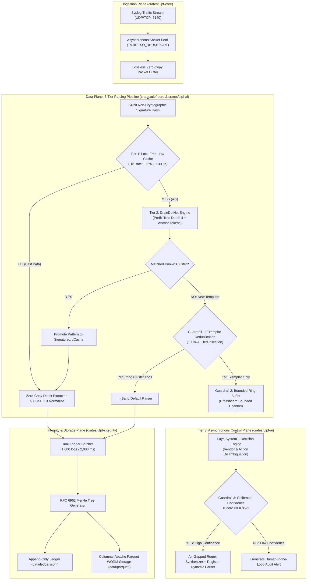

# ULPF Agent & Developer Handbook (AGENTS.md)

Welcome to the **Universal Log Pre-processing Framework (ULPF)** agent handbook. This document serves as the authoritative operational, architectural, and development manual for autonomous AI coding agents, pair programmers, and human systems engineers working on this repository.

---

## 1. Project Philosophy & System Invariants

ULPF is designed specifically for sovereign cyber defence and intelligence operations under the **National Technical Research Organisation (NTRO)** / **Smart India Hackathon (SIH26156)** problem statement. Every contribution, refactoring, or extension **MUST** strictly adhere to the following non-negotiable architectural invariants:

1. **Strict Air-Gapped Deployment Invariant:**
   * ULPF must run in 100% physically isolated, disconnected environments.
   * **Zero external runtime network dependencies.** No calls to remote APIs, Hugging Face, OpenAI, or external cloud telemetry.
   * Total standalone release binary size must remain **< 35 MB**.
2. **Zero-Copy Byte Slicing on Hot Path:**
   * The ingestion and parsing hot paths must avoid heap allocations (`String::from`, `.to_string()`, or `format!`) whenever processing packet streams.
   * Raw syslog streams are parsed using byte slices (`&[u8]`) and string slices (`&str`) borrowing directly from the pre-allocated packet buffer.
3. **Lossless Forensic Provenance:**
   * The original raw log line must be preserved **100% byte-for-byte uncompressed** in the normalized event metadata (`raw_data`).
   * The cryptographic `raw_hash` must be calculated as $\text{SHA-256}(\text{raw\_data})$ and matched for RFC 6962 Merkle tree batching.
   * All normalized events must be assigned a monotonically increasing **UUIDv7** time-ordered identifier.
4. **Action Inviolability Invariant:**
   * Perimeter security firewall actions (`ALLOW`, `PERMIT`, `ACCEPT` vs. `DENY`, `DROP`, `BLOCK`, `REJECT`) must **NEVER** be blended into the same template cluster during structural mining.
   * DrainDotNet anchor tokens (`UniqueEventPatterns`) enforce this separation deterministically.
5. **Decoupled Asynchronous Control Plane:**
   * Complex heuristic or local SLM processing (Tier-3 Laya System 1 Decision Engine) must run strictly **out-of-band** across non-blocking bounded channels (`crossbeam-channel`).
   * Line-rate ingestion (> 1.70M EPS) must never be blocked or degraded by novel cluster triage.

---

## 2. System Architecture & Multi-Tier Control Flow



---

## 3. Subagent Archetypes & Team Workflow

During ULPF engineering, tasks are delegated to specialized autonomous subagents. When invoking subagents via `invoke_subagent`, adopt the following roles:

| Subagent Role | Target Crate / Path | Core Responsibility |
| :--- | :--- | :--- |
| **Dataset Harvester & Blaster** | [`crates/ulpf-generator`](crates/ulpf-generator) | Generates high-volume synthetic and RFC-compliant Syslog traffic (10k to 500k EPS) across Cisco, FortiGate, PAN-OS, Suricata, pfSense, and Kaggle firewall datasets. |
| **Data Plane & Parser Engine** | [`crates/ulpf-core`](crates/ulpf-core) | Implements asynchronous socket listeners, zero-copy Aho-Corasick classifiers, vendor token extractors, and OCSF 1.3 `NetworkActivity` schema normalization. |
| **Integrity Plane & Merkle Storage** | [`crates/ulpf-integrity`](crates/ulpf-integrity) | Builds RFC 6962 Certificate Transparency Merkle trees, dual-trigger batchers, columnar Apache Parquet writers/readers, and forensic bit-flip tamper auditors. |
| **Air-Gapped AI & Anomaly Clustering** | [`crates/ulpf-ai`](crates/ulpf-ai) | Maintains the DrainDotNet prefix tree template miner, out-of-band Laya System 1 decision engine, 1-click dynamic parser generator, and 3-tier pipeline. |
| **Architectural Evaluator & Telemetry Suite** | [`crates/ulpf-cli`](crates/ulpf-cli) / [`evaluator.rs`](crates/ulpf-ai/src/evaluator.rs) | Executes microsecond latency percentile sampling ($p_1 \dots p_{99.99}$), throughput benchmarks, and Loghub academic accuracy audits. |

---

## 4. Key Symbols, Structs & Codebase Index

Agents should refer to these core symbols when modifying or extending ULPF:

### Core Data Plane ([`crates/ulpf-core`](crates/ulpf-core))
* [`UniversalParser`](crates/ulpf-core/src/parser/mod.rs): Unified classifier, cached parser, and multi-vendor normalization engine.
* [`SignatureLruCache`](crates/ulpf-core/src/parser/lru_cache.rs): High-speed lock-free LRU cache using 64-bit structural signature hashing.
* [`Classifier`](crates/ulpf-core/src/parser/classifier.rs): Sub-microsecond Aho-Corasick multi-pattern automaton for vendor format identification.
* [`KaggleExtractor`](crates/ulpf-core/src/parser/extractors/kaggle.rs): Extractor for Kaggle firewall traffic logs and RFC 3164 `%KAGGLE-FW-` packets.
* [`NetworkActivity`](crates/ulpf-core/src/schema/ocsf.rs): Standard OCSF 1.3 Class UID 4001 event representation.
* [`SocketIngest`](crates/ulpf-core/src/ingest/socket.rs): Async UDP/TCP socket listener supporting `SO_REUSEPORT` multi-core socket reuse.

### AI & Template Mining ([`crates/ulpf-ai`](crates/ulpf-ai))
* [`TieredPipeline`](crates/ulpf-ai/src/pipeline.rs): Orchestrates the 3-tier pipeline (`LRU` $\to$ `DrainDotNet` $\to$ `Laya`).
* [`DrainMiner`](crates/ulpf-ai/src/drain.rs): Fixed-depth ($d=4$) prefix tree log template miner with non-maskable anchor tokens.
* [`LayaDecisionEngine`](crates/ulpf-ai/src/laya.rs): Deterministic categorical decision engine for vendor classification and threat scoring.
* [`Onboarder`](crates/ulpf-ai/src/onboarder.rs): Air-gapped 1-click regex synthesizer and dynamic JSON/YAML parser loader.
* [`EvaluatorEngine`](crates/ulpf-ai/src/evaluator.rs): Hardcore architectural benchmark and academic accuracy audit suite.

### Cryptographic Integrity & Storage ([`crates/ulpf-integrity`](crates/ulpf-integrity))
* [`MerkleTree`](crates/ulpf-integrity/src/merkle.rs): RFC 6962 Certificate Transparency compliant Merkle tree implementation with inclusion proof generation.
* [`Batcher`](crates/ulpf-integrity/src/batcher.rs): Dual-trigger batch accumulator (1,000 events or 2,000 ms duration).
* [`StorageWriter`](crates/ulpf-integrity/src/storage.rs): Columnar Apache Parquet serialiser with Snappy compression.
* [`ForensicVerifier`](crates/ulpf-integrity/src/tamper.rs): Bit-for-bit Parquet audit and SHA-256 recalculation engine.

---

## 5. Agent Operational Recipes & Runbooks

### Recipe 0: How to Audit Ingestion & Parsing Health
Whenever modifying extractors or classifiers, verify 100% extraction and endpoint presence:
```bash
./target/release/ulpf audit --data-dir data/raw --verbose
```
**Verification Gate:**
* Classification Rate across all datasets must be **100.0%**.
* Parsing Success Rate must be **100.0%**.
* Missing IP Endpoints must be **0**.

### Recipe 1: How to Add a New Vendor Log Parser
To add support for a new firewall (e.g. Check Point, Juniper SRX, or VyOS):
1. **Define Vendor Format:** In [`crates/ulpf-core/src/parser/classifier.rs`](crates/ulpf-core/src/parser/classifier.rs), add the new vendor enum variant to `VendorFormat`.
2. **Add Detection Patterns:** In `Classifier::new()`, register identifying string prefixes into the Aho-Corasick automaton.
3. **Implement Extractor:** In `crates/ulpf-core/src/parser/extractors/`, create `<vendor>.rs` implementing a zero-copy tokenizer that maps fields to OCSF 1.3 `NetworkActivity`.
4. **Wire into UniversalParser:** In [`crates/ulpf-core/src/parser/mod.rs`](crates/ulpf-core/src/parser/mod.rs), add the extractor to `UniversalParser::parse()`.
5. **Add Unit & Integration Tests:** In `crates/ulpf-core/tests/parser_tests.rs`, add 5+ realistic sample log lines and assert 100% field extraction accuracy and SHA-256 preservation.

### Recipe 2: How to Add New OCSF Schema Classes
To extend beyond Class 4001 (`NetworkActivity`):
1. In [`crates/ulpf-core/src/schema/ocsf.rs`](crates/ulpf-core/src/schema/ocsf.rs), define the new OCSF struct (e.g. `Authentication` Class 3001 or `DNSActivity` Class 4003).
2. Ensure the struct contains `metadata: Metadata` with `raw_data`, `raw_hash`, `event_id`, and `ingest_time`.
3. In [`crates/ulpf-integrity/src/storage.rs`](crates/ulpf-integrity/src/storage.rs), update the Arrow schema if new top-level columns are required in Parquet.

### Recipe 3: How to Execute Regression & Accuracy Benchmarks
Whenever touching the parsing hot path or Drain template miner, agents must run the full comparative evaluator:
```bash
# 1. Compile in optimized release mode
cargo build --release

# 2. Run isolated dual comparative evaluation across 16 threads
./target/release/ulpf evaluate --engine all --duration 3 --threads 16 --samples 10000 --out eval_hardcore_report.md
```
**Verification Gates:**
* Median latency ($p_{50}$) for 3-Tier Pipeline must remain **< 5.0 µs**.
* Tier-1 LRU Cache Hit Rate must exceed **90.0%**.
* Action Inviolability must remain **100% PRESERVED**.
* Grouping Accuracy (`GA %`) must remain **> 90.0%**.

### Recipe 4: Code Quality & Workspace Verification Gate
Before committing or submitting changes, agents **MUST** execute:
```bash
# 1. Check for warnings and enforce clippy standards
cargo clippy --workspace --all-targets -- -A clippy::too_many_arguments -A clippy::field_reassign_with_default -D warnings

# 2. Format all crates
cargo fmt --all -- --check

# 3. Run all workspace tests (56+ tests)
cargo test --workspace
```

---

## 6. Directory Structure Overview

```
logs_proj/
├── AGENTS.md                  # This agent development handbook
├── README.md                  # Public documentation & user quickstart
├── Cargo.toml                 # Workspace root manifest
├── Cargo.lock                 # Hermetic lockfile
├── crates/
│   ├── ulpf-core/             # Ingest sockets, Aho-Corasick classifier, zero-copy extractors, OCSF 1.3 schema, SignatureLruCache
│   ├── ulpf-integrity/        # RFC 6962 Merkle tree, dual-trigger batcher, Parquet storage, forensic tamper verifier
│   ├── ulpf-ai/               # DrainDotNet miner, Laya decision engine, 1-click onboarder, 3-tier pipeline, hardcore evaluator
│   ├── ulpf-generator/        # Multi-threaded async Syslog UDP/TCP traffic generator
│   └── ulpf-cli/              # Operational CLI binary (`ulpf`)
├── data/
│   ├── raw/                   # Ground-truth raw datasets: Cisco ASA, FortiGate, PAN-OS, Suricata, pfSense, Kaggle firewall
│   ├── parquet/               # Parquet database blocks (sample blocks block_00000.parquet, block_00001.parquet tracked)
│   └── ledger.jsonl           # Append-only cryptographic Merkle ledger
├── docs/                      # Architectural specifications, slides, demo scripts, and SIH evaluation dossiers
└── scripts/                   # Helper automation scripts: run_demo.sh, simulate_tamper.py, populate_datasets.py
```
